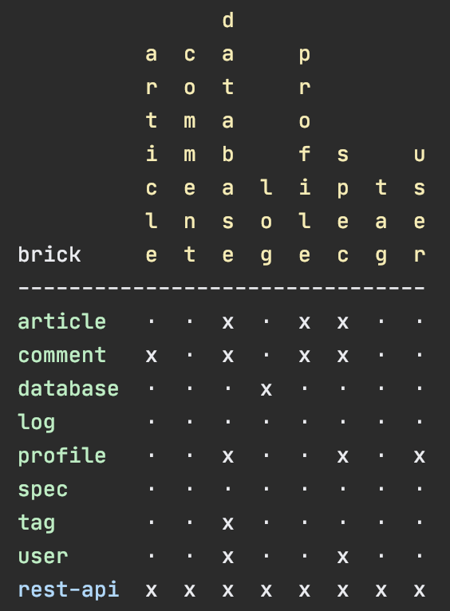

# 

If you are using the old Leiningen based tool, we recommend you to migrate to the 
[new tool](https://github.com/tengstrand/polylith) that is based on 
tools.deps by following the instructions further down here.

Before we start, it may be interesting to get an idea of why you should migrate to the new tool:

- The new tool is based on [tools.deps](https://github.com/clojure/tools.deps.alpha) which is both flexibility, powerful,
  and is supported by the company that created  Clojure. Tools.deps is also a really good fit for the Lego like way of working with code in Polylith.
- The symbolic links are gone, which means less complexity.
- Microsoft Windows is supported out of the box.
- You are less dependent on tool support. Operations such as moving, renaming and deleting
  environments, components and bases can easily be done from your favourite editor/IDE and there is
  no need for the `add`, `remove` and `delete` commands. 
- The empty workspace interfaces are gone. They are instead implicitly declared by the components themselves
  which is nicer to work with.
- How you work with the code is greatly improved. Now you can work with the project from the workspace root
  with access to all environments, components and bases, from one place, not just the development environment as before. 
- Simplified nomenclature and workflows. Systems, services and environments are now all called _environments_.
- Support for more than one environment where each environment can specify what `src`, `test` and `resources`
  folders should be included. Environments can have different versions of the same library if needed.
- Improved testing experience:
  - The compilation step of each component and base has been removed which substantially speeds up things,
    especially if you have many components and bases. The component contracts (interfaces) are instead 
    checked by the `check` command via a [git hook](https://git-scm.com/book/en/v2/Customizing-Git-Git-Hooks)
    (optional).
  - The tests execute much faster by only starting the JVM once, and then run all the tests in isolation by separate class loaders.
  - Environments can have their own `tests` (and even `src` and `resources` folder).
  - Output from the text execution is displayed continously.
- The REPL experience has been improved. When working with a codebases that contains interfaces that are implemented by
  more than one component (more common in larger systems) it's now possible to switch between 
  configurations to immitate different environments, by the use of `profiles` which is a new concept.
- No need for the `prompt` command. The new `poly` command is several times faster than the old
  Leiningen based plugin and starts in a second.
- Improved workspace checks, error messages.
- New diagrams showing component and library dependencies.

Other differences:
- Arguments are passed to commands by name, like `poly create w name:my-ws top-ns:com.mycompany`.
- No support for empty top namespaces. The use of empty top namespaces is bad practice.
- Before, we created a "system" that automatically created a base. Now, bases and environments
  are created separately.
- When you create a component or base, no example code is created, like the `add-two` functions.
- Type hints in functions are now part of the interface contract.
- If a definition is defined as `defn` in one interface, it must be implemented
  as a function in all components for that interface (not mixing `defn` and `defmacro`)
  and also the other way around.
- Changes are calculated using git, which makes git mandatory. 
  The local timestamps and bookmarks are gone. Instead, the new tool supports tagging a stable point in time 
  from which all changes are calculated.
  The main reason we changed this, was that timestamps in files
  weren't reliable, because they were reset when switching between branches in git.
- The `build` command has been removed. Now you configure what to build in the `deps.edn` files
  under each environment which are then used in combination with the `clj` command and build scripts.
- The new `deps` command is heavily improved, except that it can't display function dependencies at the moment.
- Libraries are specified per environment and not per componend or base. Which namespace is associated 
  with which library can be specified, so that a diagram with all dependencies can be displayed
  using the `deps` command.
- No `sync` command. Missing components or libraries will be shown as errors which needs to be manually added
  to each environment's `deps.edn`. This is part of the philosophy of the new tool, to have less magic and more control!

Now, let's migrate a lein-polylith project.

# Migrate

Before we start, make sure you have these two tools installed:
- [git](https://git-scm.com/book/en/v2/Getting-Started-Installing-Git)
- [clj](https://clojure.org/guides/getting_started)

The migration is performed by the new Polylith tool which we can download by cloning it:
```bash
git clone git@github.com:tengstrand/polylith.git
cd polylith
git checkout core
```

To verify the installation, type:
```bash
clj -A:poly info
```
If everything went well, the workspace of the Polylith tool is shown:<br>

 

Now it's time to migrate a project. 

> Note: Here we will use the realworld example app as an example, but you should preferable
> use your own Leiningen based Polylith project to migrate.

Let's clone the [realworld example app](https://github.com/furkan3ayraktar/clojure-polylith-realworld-example-app/tree/clojure-deps)
from the same directory as the `polylith` project:
```bash
cd ..
git clone git@github.com:furkan3ayraktar/clojure-polylith-realworld-example-app.git
```
We should now have these two directories:
```bash
clojure-polylith-realworld-example-app
polylith
```

Let's migrate the `clojure-polylith-realworld-example-app`:
```bash
cd polylith
clj -A:poly-migr ../clojure-polylith-realworld-example-app
```

The new migrated `clojure-polylith-realworld-example-app-01` directory was added:
```bash
clojure-polylith-realworld-example-app
clojure-polylith-realworld-example-app-01
poly
```

> Note: The old project is left untouched, and you can run this migration step as many times as you want.
>       Every time you do, a new folder with an increased number will be created.

Let's verify the migration:
```bash
cd clojure-polylith-realworld-example-app-01
clj -A:poly deps
```


We could also check the library dependencies:
```bash
clj -A:poly deps :lib
```


You have probably noticed that a lot of the x's are missing and the reason is that we have to
manually update the  `:ns->lib` key in the `:polylith` section in `deps.edn` and tell
which namespace belongs to which library.

# Replace the old workspace

Now when we have a migrated workspace (`clojure-polylith-realworld-example-app-01`)
we want to do two things:
- Verify that it works.
- Use the new workspace.

## Verify that it works

The migrated project is not initialized with git yet, which is mandatory to get all the functionality
that relies on change management to work, like running tests or to show the * symbol for changed
components/bases/environments in the `info` command. Before we do that, you can play around with the 
migrated workspace and run all the commands except the `test` command which will not work.

The _poly_ command can either be executed from the `polylith` directory with `clj -A:poly` plus argument(s), or
by installing the `poly` tool and use that.

You can read about how to properly install and use the new Polylith tool
[here](https://github.com/tengstrand/polylith).

## Use the new workspace

When the migrated project seems to work, it is time to decide how to continue.
You need to do one of two things:
1. Use the same repository as the old workspace
2. Create a new git repository

The new tool stores components and bases in the same way as the old Leiningen based version,
so if you want to keep the history of your changes, we recommend you to go for option 1.

### 1. Use the same repository as the old workspace

If you go for this option, we recommend you to create a git branch, like `polylith-deps` or similar,
and work from there.

> Note: More documentation and examples on how to configure your CI build will come soon

As we mentioned before, the new tool doesn't contain any `build` command. Instead it's up to you to
decide how to use [tools.deps](https://github.com/clojure/tools.deps.alpha), 
scripts and maybe other tooling, to build the artifacts you need.

Make sure you work from the newly created branch, e.g. `polylith-deps`.
With `old` we refere to the Leiningen based `clojure-polylith-realworld-example-app` workspace,
and with `new` we refere to the migrated `clojure-polylith-realworld-example-app-01` workspace:
- Delete the `project.clj` file from the root in the old workspace.
- Delete the `interfaces` directory from the old workspace.
- Copy `deps.edn` from the root of the new workspace to the old.
- You may update the old `readme.md` file at the root by copying the changed 
  information/links from the new `readme.md`.
- Make sure you can build all the artifacts you need, by adding aliases to `deps.edn`,
  creating build scripts and similar.
  If you used the old `build.sh` under each `system` then they need to be replaced.
  You also may have a `.circleci/config.yaml` at the root, and maybe scripts, that also needs to be replaced
  or updated.
- Rename the old `environments` directory to `old-environments`.
- Copy the new `environments` to the old workspace.
- Go through all `deps.edn` files (the one at the root and the ones in each directory under `environments`)
  and check that keywords like `:exclusions` in the library dependencies have been correctly migrated,
  compared to what's in each `project.clj` in `old-environments` and the systems under the `systems` directories.
- Delete the `old-environments` directory.
- Delete the `systems` directory.
- The new tool only uses the `src`, `test` and `resources` directories under each component
  and base and if you have other files there, they can be deleted (you may want to keep the `readme.md` files).
- If you have any components or bases that is not included in any other environment than
  `development`, then this code can be moved to the new `development` directory 
  that is a dedicated for this use:
  - Create a top namespace under `development/src`, e.g. `dev`.
  - If you have any test code that you also want to move, create the `development/test` directory
    and add the path to the root `deps.edn`. Also create a test namespace, e.g. `dev-test`.
  - Delete `development/src/.keep` (it was only there to stop git from removing the directory).
  - Create and organize the namespaces under `dev` (and eventually `dev-test`) in any way you like 
    (e.g. one per developer).
  - Copy the code from those components and bases to the newly created namespaces.
  - Delete these components and bases.

### 2. Create a new repository

If you go for this option, you can follow the above instructions about how to verify the workspace
except that you keep the migrated workspace as it is and just add git support to it.
