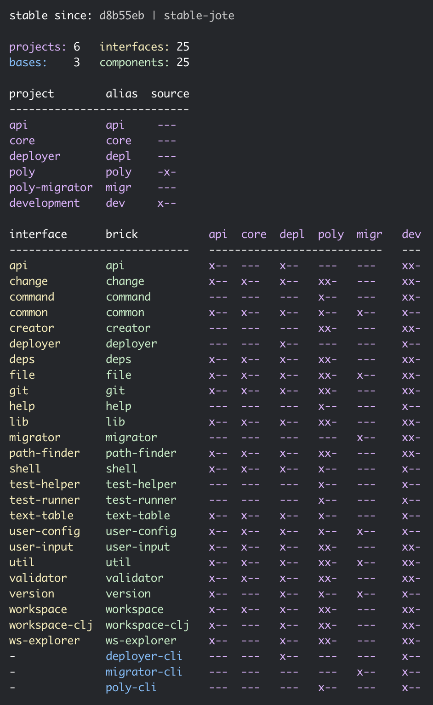

# 

If you are using the old Leiningen based tool, we recommend you to migrate to the 
[new tool](https://github.com/polyfy/polylith) that is based on [tools.deps](https://github.com/clojure/tools.deps.alpha) 
by following the instructions further down here.

Before we start, it may be interesting to get an idea of why you should migrate to the new tool:

- The new tool is based on [tools.deps](https://github.com/clojure/tools.deps.alpha) which is flexibility, powerful,
  and supported by Cognitect.
  Tools.deps is also a really good fit for the Lego-like way of working with code in Polylith.
- The symbolic links are gone, which means less complexity and that Emacs/CIDER and Windows now works out of the box.
- A more streamlined naming. Systems, services and development environments are now all handled as _projects_.
- You are less dependent on tool support. Operations such as moving, renaming and deleting
  projects, components and bases can easily be done from your favourite editor/IDE and there is
  no need for the `add`, `remove` and `delete` commands. 
- The empty workspace interfaces are gone. The interfaces are instead implicitly declared by the components themselves
  and the time is over when you needed to update them in two places.
- The way you work with the code has greatly improved. Now you have access to all projects, components 
  and bases, from the workspace root, not just from the development environment as before. 
- Support for more than one project where each project specifies what components, bases, libraries,
  resources and tests that are included.
- Improved testing experience:
  - The compilation step of each component and base has been removed which substantially speeds up things,
    especially if we have many components and bases. The component contracts (interfaces) are instead 
    checked by the `check` command that can be called by a [git hook](https://git-scm.com/book/en/v2/Customizing-Git-Git-Hooks)
    to ensure consistency of the workspace (optional).
  - The tests execute much faster by only starting the JVM once, and then run all the tests in isolation by separate class loaders.
  - Output from the text execution is displayed continously.
- Introduction of the `profile` concept that allow us to emulate different projects (services/systems) from the development environment.
- No need for the `prompt` command. The new `poly` command is several times faster than the old
  Leiningen based plugin and starts in a second.
- Powerful diagrams that views the project status, dependencies to interfaces and components, and what libraries that are included.
- The new `ws` command that allows us to explore the internal structure of he workspace with support for 
  export/import which allow us to shared how the workspace looks like without sending the code.

Other differences:
- Arguments are passed to commands by name, like `poly create w name:my-ws top-ns:com.mycompany`.
- No support for empty top namespaces. The use of empty top namespaces is bad practice anyway.
- Before, we created a "system" that automatically created a base. Now, bases and projects are created separately.
- When we create a component or base, no example code is created, like the `add-two` functions.
- Type hints in functions are now part of the interface contract.
- If a definition is defined as `defn` in one interface, it must be implemented
  as a function in all components for that interface (not mixing `defn` and `defmacro`)
  and also the other way around.
- Changes are calculated using git, which makes git mandatory. 
  The local timestamps and bookmarks are gone. Instead, the new tool supports tagging a stable point in time 
  from which all changes are calculated.
  The main reason we changed this, was that timestamps in files
  weren't reliable, because they were reset when switching between branches in git.
  Another good reason is that we can let our CI build set the latest stable point in time for us.
- The `build` command has been removed. Now we configure what to build in the `deps.edn` files
  for each project in combination with tools and scripts.
- No `sync` command. Missing components or libraries will be shown as errors which needs to be manually added
  to each project's `deps.edn`. This is part of the philosophy of the new tool, to have less magic and more control!

Now, let's migrate a lein-polylith project.

# Migrate

Before we start, make sure you have these two tools installed:
- [git](https://git-scm.com/book/en/v2/Getting-Started-Installing-Git)
- [clj](https://clojure.org/guides/getting_started)

The migration is performed by the new Polylith tool which we can downloaded by cloning it:
```bash
git clone git@github.com:polyfy/polylith.git
cd polylith
```

To verify the installation, type:
```bash
clj -A:poly info
```
If everything went well, the workspace of the Polylith tool is shown:<br>

 

Now it's time to migrate a project. 

> Note: Here we will use the realworld example app as an example, but you should preferable
> use your own Leiningen based Polylith project to migrate.

Let's clone the [realworld example app](https://github.com/furkan3ayraktar/clojure-polylith-realworld-example-app/tree/master):
```bash
cd ..
git clone git@github.com:furkan3ayraktar/clojure-polylith-realworld-example-app.git
```
We should now have these two directories:
```bash
clojure-polylith-realworld-example-app
polylith
```

Let's migrate the `clojure-polylith-realworld-example-app`:
```bash
cd polylith
clj -A:migrator ../clojure-polylith-realworld-example-app
```

The new migrated `clojure-polylith-realworld-example-app-01` directory was created:
```bash
clojure-polylith-realworld-example-app
clojure-polylith-realworld-example-app-01
polylith
```

> Note: The old project is left untouched, and you can run this migration step as many times as you want.
>       Every time you do, a new folder with an increased number will be created.

Let's verify the migration:
```bash
cd clojure-polylith-realworld-example-app-01
clj -A:poly deps
```


We can also check the library dependencies:
```bash
clj -A:poly libs
```


# Replace the old workspace

Now when we have a migrated workspace (`clojure-polylith-realworld-example-app-01`)
we want to do two things:
- Verify that it works.
- Use the new workspace.

## Verify that it works

The migrated project is not initialized with git yet, which is mandatory to get all the functionality
that relies on change management to work, like running tests or to show the * symbol for changed
components/bases/projects in the `info` command. Before we do that, you can play around with the 
migrated workspace and run all the commands except the `test` command which will not work.

The _poly_ command can either be executed from the `polylith` directory with `clj -A:poly` plus argument(s), or
by [installing](https://github.com/polyfy/polylith#installation) the `poly` tool and use that.

## Use the new workspace

When the migrated project seems to work, it is time to decide how to continue.
You need to do one of two things:
1. Use the same repository as the old workspace
2. Create a new git repository

The new tool stores components and bases in the same way as the old Leiningen based version,
so if you want to keep the history of your changes, we recommend you to go for option 1.

### 1. Use the same repository as the old workspace

If you go for this option, we recommend you to create a git branch, like `polylith-deps` or similar,
and work from there, and merge it back when everything works.

As we mentioned before, the new tool doesn't contain any `build` command. Instead it's up to you to
decide how to use [tools.deps](https://github.com/clojure/tools.deps.alpha), 
scripts and maybe other tooling, to build the artifacts you need.

To proceede from here, you can either learn the new tool and do the migration yourself, because it will
be quite obvious what you should keep and what can be deleted, or you can continue with the detailed instruction below,
with the risk that you don't know what you are doing! As long as you work in a new branch, you should be 
safe in either cases.

Make sure you work from the newly created branch, e.g. `polylith-deps`.
With `old` we refere to the Leiningen based `clojure-polylith-realworld-example-app` workspace (think your Leiningen based workspace),
and with `new` we refere to the migrated `clojure-polylith-realworld-example-app-01` workspace (think your migrated workspace):
- Delete the `project.clj` file from the root in the old workspace.
- Delete the `interfaces` directory from the old workspace.
- Copy `deps.edn` from the root of the new workspace to the old.
- You may update the old `readme.md` file at the root by copying the changed 
  information/links from the new `readme.md`.
- Make sure you can build all the artifacts you need, by adding aliases to `deps.edn`,
  creating build scripts and similar.
  If you used the old `build.sh` under each `system` then they need to be replaced with something that involves `tool.deps`.
  You also may have a `.circleci/config.yaml` at the root, and maybe scripts, that also needs to be replaced
  or updated.
- Copy the `projects` directory from the new workspace to the old workspace.
- Go through all `deps.edn` files (the one at the root and the ones in each directory under `projects`)
  and check that keywords like `:exclusions` in the library dependencies have been correctly migrated,
  compared to what's in each `project.clj` in `environments` and the projects under the `systems` directories.
- Delete the `environments` directory.
- Delete the `systems` directory.
- The new tool only uses the `src`, `test` and `resources` directories under each component
  and base and if you have other files there, they can be deleted (you may want to keep the `readme.md` files).
- If you have any components or bases that are not included in any other project than the
  `development` project, with the only purpose to be used as some kind of tooling, 
  then this code should be moved to the new `development` directory that is a dedicated for this use:
  - Create a top namespace under `development/src`, e.g. `dev` and maybe some sub namespaces.
  - Copy the code from the components we want to move to the `dev` namespace or to any sub namespace of `dev`
    in `development`.
  - Delete these components and bases.
  - If you have any test code that you also want to move, create the `development/test` directory
    and add the "development/test" path to the `:test` alias in `./deps.edn`. Also create the same namespace(s) 
    as for `development/src`, e.g. `development/test/dev`.
  - Delete `.keep` files for directories that are not empty.
  
### 2. Create a new repository

If you go for this option, you can follow the above instructions about how to verify the workspace
except that you keep the migrated workspace as it is and just add git support to it.
