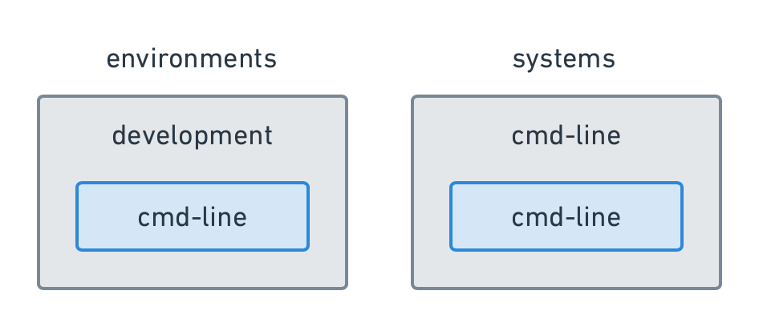
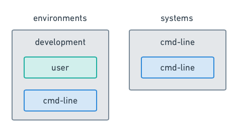
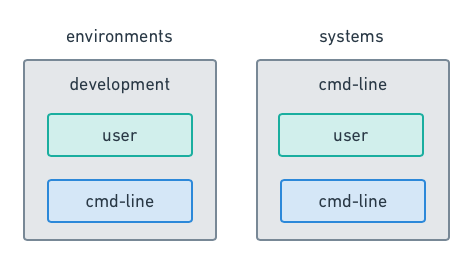
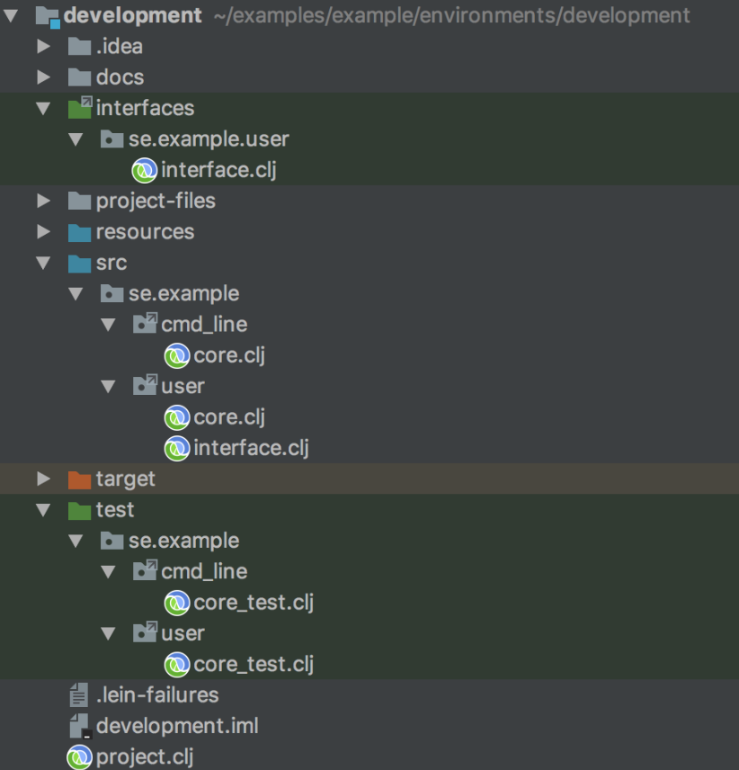
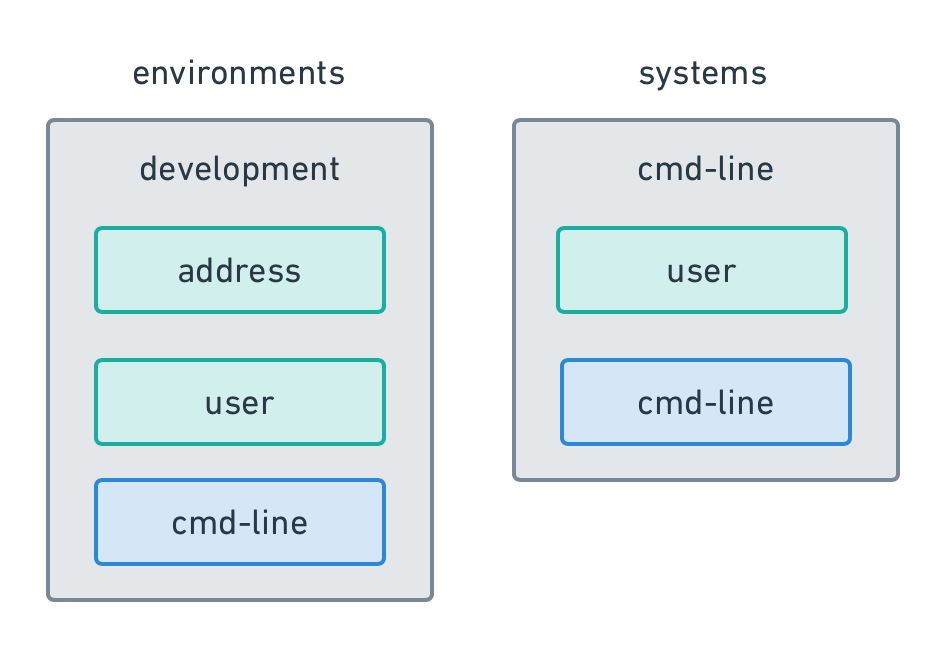
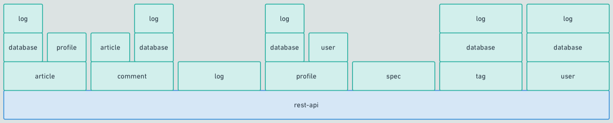
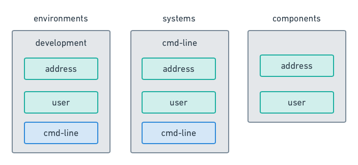
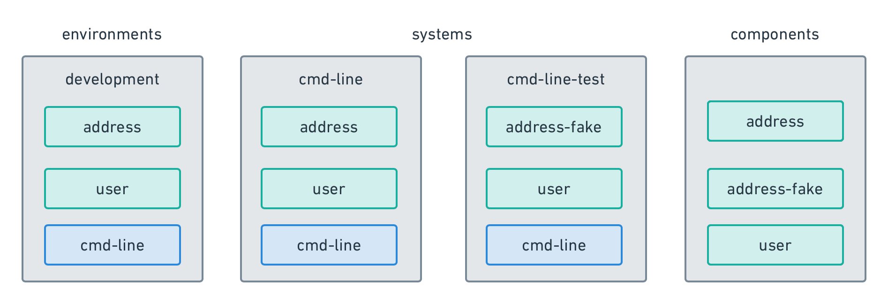

# 
A leiningen plugin to manipulate Polylith based architectures.

[](https://circleci.com/gh/tengstrand/lein-polylith/tree/master)

Polylith is a way of organising code into reusable building blocks that are used to create systems. To better understand the principles and ideas behind it, we recommend you first read the Polylith [documentation](https://polylith.gitbook.io/polylith/why-polylith).

Organising code as a Polylith can be done manually, which was actually how it all began. With that said, there is no magic behind this way of organising the code. It's not a framework nor a library, just a simple yet powerful design pattern which can be used to improve your current and future architecture.

The reason we built this [Leiningen](https://leiningen.org) plugin was to make life easier for you as a developer by making the work more efficient, reducing the risk of human mistakes and by offering a number of useful commands that turn the work as a [DevOps](https://en.wikipedia.org/wiki/DevOps) to a joyful experience.

We hope this will make you a happier developer as it did with us and that the Polylith way of organising systems will soon be your preferable choice.

Happy coding!

## Table of Contents

- [Installation](#installation)
- [Plugin help](#plugin-help)
- [Workspace](#workspace)
- [System](#system)
- [Base](#base)
- [Component](#component)
- [Interface](#interface)
- [Development](#development)
- [Dependencies](#dependencies)
- [Test](#test)
- [Design](#design)
- [RealWorld Example](#realworld-example)
- [Commands](#commands)
    - [add](#add)
    - [build](#build)
    - [changes](#changes)
    - [compile](#compile)
    - [create](#create)
    - [delete](#delete)
    - [deps](#deps)
    - [diff](#diff)
    - [info](#info)
    - [remove](#remove)
    - [settings](#settings)
    - [success](#success)
    - [sync-deps](#sync-deps)
    - [prompt](#prompt)
    - [test](#test)
- [What's next?](#whats-next)
- [Thanks](#thanks)

## Installation

If you haven't done it already, start by installing [Leiningen](https://leiningen.org).

The next thing to do is to add the Polylith plugin to `~/.lein/profiles.clj`. After editing the file it should look something like this:
```clojure
{:user {:plugins [[polylith/lein-polylith "LATEST"]]}}
```

This ensures that the Polylith plugin can be called from anywhere in the file system and not just from the *workspace root* where the *project.clj* file with the Polylith declaration resides:
```clojure
...
:plugins [[polylith/lein-polylith "0.0.45-alpha"]]
```

If called from the workspace root then it will use *0.0.45-alpha* in this case, otherwise it will use the latest version of the plugin.

### Latest version
[](http://clojars.org/polylith/lein-polylith)

## Plugin help

Go to [Commands] to read how to use the built-in help.

## Workspace
The workspace is the top-level container for all your code and everything you need to create Polylith systems.

Let’s start by creating the *example* workspace with the top namespace *se.example*:
```
$ lein polylith create w example se.example
```

The workspace directory structure will end up like this:
```
example                         # root directory
  bases                         # empty directory
  components                    # empty directory
  environments
    development                 # the development environment
      ...
  interfaces
    project.clj                 # the interfaces project file
    src                         # source directory
      se                        # top namespace: se.example
        example                 # empty directory (no tests added yet)
  logo.png                      # used by readme.md
  project.clj                   # project file for the workspace
  readme.md                     # documentation
  systems                       # empty directory
```

When you get used to it, you will love this structure because everything lives where you expect to find it. The bases live in bases, components in components, systems in systems, development environments in environments and interfaces in the interfaces’ src directory beneath the top namespace `se.example`.

If you for example have the top namespace `com.a.b.c` and the component *user* then all its namespaces will live under the namespace path `com.a.b.c.user`. If the *user* component has a core namespace then it will automatically get the namespace `com.a.b.c.user.core`.

Right now the plugin doesn’t support changing the name of the top namespace. The advice is therefore to think carefully when deciding the name of the top namespace.

The plugin uses the [convention over configuration](https://en.wikipedia.org/wiki/Convention_over_configuration) idea to reduce the amount of configuration to a minimum. It doesn’t use configuration files, annotations, dependency injection or similar to assemble its parts. Instead it uses [symbolic links](https://en.wikipedia.org/wiki/Symbolic_link) directly in the file system. So just look in the file system or use the `info` command to inspect all the parts of the workspace.

The development environment contains these files:
```
      docs                      # empty dir
      interfaces                # link to interfaces/src
      project-files
        bases                   # empty dir
        components              # empty dir
        interfaces-project.clj  # link to interfaces/project.clj
        systems                 # empty dir
        workspace-project.clj   # link to project.clj
      project.clj
      resources                 # empty dir
      src                       # source dir
        se                      # top namespace: se.example
          example               # empty dir (no source code added yet)
      test                      # source test dir
        se                      # top namespace: se.example
          example               # empty dir (no source code added yet)
```

The *development* directory will be the root directory when you work with the code in your development environment. Whenever you create a new *component* or *system*, the development environment will be updated automatically, letting you concentrate on writing code!

To make sure that git doesn’t remove empty directories, the plugin will put a .keep file in the empty ones. It’s important that they are not removed when you clone a repository (workspace) otherwise the plugin will not work properly.

Let’s have a look at some files in the workspace so we get an idea of what’s in there.

The Leiningen *project.clj* file defines which version of Polylith plugin to use, the name of the top namespace and the Clojure version to use:
```clojure
(defproject se.example/example "1.0"
  :description "A Polylith workspace."
  :plugins [[polylith/lein-polylith "0.0.45-alpha"]]
  :polylith {:top-namespace "se.example"
             :clojure-version "1.9.0"})
```

The *interfaces/project.clj* file describes how to compile all the public interfaces and looks like this:
```clojure
(defproject se.example/interfaces "1.0"
  :description "Component interfaces"
  :dependencies [[org.clojure/clojure "1.9.0"]]
  :aot :all)
```

The *environments/development/project.clj* file is the project file for the development environment and looks like this:
```clojure
(defproject se.example/development "1.0"
  :description "The main development environment"
  :dependencies [[org.clojure/clojure "1.9.0"]])
```

We will talk more about these file later. 

Go to the newly created workspace:
```
$ cd example
```

If we now run the *info* command, it will list the contents of the workspace...
```
$ lein polylith info

interfaces:
components:
bases:
systems:
environments:
  development
```

...which is empty at the moment because we haven’t added anything yet.

### The prompt
A nice way of working with the plugin is to start a prompt:
```
$ lein polylith prompt
```

This will enter a prompt within the *example* namespace:
```
example$>
```

The benefits with this are that commands execute instantly and also that you don’t need to repeat “lein polylith” before every command.

We can execute the info command again by just typing `info`:
```
example$> info
interfaces:
components:
bases:
systems:
environments:
  development
```

Type `quit` or `exit` to exit:
```
example$> exit
```

Everywhere in this documentation where we say you should type something like `lein polylith command` we mean just `command` if you are inside a prompt.

Feel free to start a prompt, it will save you some time and typing!

## System

A system consists of a base at the bottom with components and libraries above:<br>


This is well explained in the Polylith [documentation](https://polylith.gitbook.io/polylith/why-polylith). The idea is to compose systems with smaller building blocks instead of putting everything into one place as a monolith. To describe a system we need to start with the base.

## Base

The base is the foundation of a system:<br>


A system can only have one base. The base exposes a public API to the outer world, illustrated as sockets in the metaphor. In the *cmd-line* base that we will soon create, the public API will consist of a single `main` function that prints out “Hello world!”:
```clojure
(defn -main [& args]
  (println "Hello world!"))
```

Let’s create the *cmd-line* system:
```
$ lein polylith create s cmd-line
```

If you don’t give a third argument to *create* then the base will get the same name as the system, in this case *cmd-line*. The *development* environment and the *cmd-line* system will now both contain the *cmd-line* base (in blue):<br>


Run the `info` command again to see the result:
```
$ lein polylith info

interfaces:
components:
bases:
  cmd-line *
systems:
  cmd-line *
    cmd-line *   -> base
environments:
  development
    cmd-line *   -> base
```

We can see that the *cmd-line base* and the *cmd-line system* were created. The cmd-line *base* is automatically added to the cmd-line *system* and to the *development* environment. The “-> base” means that they both link to a *base*. The * symbols indicate that something has changed since *the last successful build* (more on that later).

The workspace now looks like this on disk:
```
example
  bases
    cmd-line                # new 
      project.clj           # new (cmd-line build file)
      readme.md             # new (almost empty documentation)
      resources
        cmd-line            # new (empty dir - to put cmd-line resources)
      src/se/example
        cmd-line            # new
          core.clj          # new (cmd-line core namespace)
      test/se/example
        cmd-line            # new
          core_test.clj     # new (cmd-line core-test namespace)
  environments
    development
      docs
        cmd-line-readme.md  # new (link to bases/cmd-line/readme.md)
      project-files
        bases
          cmd-line-project.clj  # new (link to bases/cmd-line/project.clj)
        systems
          cmd-line-project.clj  # new (link to systems/cmd-line/project.clj)
      resources
        cmd-line     # new (link to bases/cmd-line/resources/cmd-line)
      src/se/example
        cmd-line     # new (link to bases/cmd-line/src/se/example/cmd-line)
      test/se/example
        cmd-line     # new (link to bases/cmd-line/test/se/example/cmd-line)
  systems
    cmd-line
      build.sh
      project.clj
      readme.md
      resources
        cmd-line  # link to bases/cmd-line/resources/cmd-line
      src/se/example
        cmd-line  # link to bases/cmd-line/src/se/example/cmd-line
```

If we have a look at some of the generated files, we first find `systems/cmd-line/src/se/example/cmd_line/core.clj`:
```clojure
(ns se.example.cmd-line.core
  (:gen-class))

;; A stand alone base example. Change to the right type of base.
(defn -main [& args]
  (println "Hello world!"))
```

...with its corresponding test `systems/cmd-line/test/se/example/cmd_line/core_test.clj`:
```clojure
(ns se.example.cmd-line.core-test
  (:require [clojure.test :refer :all]
            [se.example.cmd-line.core :as core]))

;; Add tests here...
(deftest hello-world-example-test
  (let [output (with-out-str (core/-main))]
    (is (= "Hello world!\n"
           output))))
```

...then we also have `systems/cmd-line/project.clj` that is the project file for the *cmd-line* system:
```clojure
(defproject se.example/cmd-line "0.1"
  :description "A cmd-line system."
  :dependencies [[org.clojure/clojure "1.9.0"]]
  :aot :all
  :main se.example.cmd-line.core)
```

...and `systems/cmd-line/build.sh` that is the script that performs the final step to build an artifact for the system, in this case an uberjar:
```
#!/usr/bin/env bash
set -e

lein uberjar
```

Let’s run the build command:
```
$ lein polylith build

Changed components:
Changed bases: cmd-line
Changed systems: cmd-line

Compiling interfaces
Created /Users/joakimtengstrand/examples/example/interfaces/target/interfaces-1.0.jar
Wrote /Users/joakimtengstrand/examples/example/interfaces/pom.xml
Installed jar and pom into local repo.

Compiling bases/cmd-line

Compiling systems/cmd-line

Start execution of tests in 1 namespaces:
lein test se.example.cmd-line.core-test

lein test se.example.cmd-line.core-test

Ran 1 tests containing 1 assertions.
0 failures, 0 errors.

Building systems/cmd-line
Created /Users/joakimtengstrand/examples/example/systems/cmd-line/target/cmd-line-0.1.jar
Created /Users/joakimtengstrand/examples/example/systems/cmd-line/target/cmd-line-0.1-standalone.jar
```

A build performs these steps:
1. checks for circular dependencies and quit if found.
2. calculates what components and bases to build based on what has changed since the last successful build.
3. calls sync-deps and makes sure that all dependencies in project.clj files are in sync.
4. AOT compile changed components, bases and systems to check that they compile against the interfaces.
5. runs tests for all bases and components that have been affected by the changes.
6. executes build.sh for all changed systems.
7. if the entire build is successful and no steps are omitted, the success command that updates the time for last successful build is executed.

We can now execute the newly-generated executable system:
```
$ java -jar systems/cmd-line/target/cmd-line-0.1-standalone.jar
Hello world!
```

If we run the `info` command again:
```
$ lein polylith info

interfaces:
components:
bases:
  cmd-line
systems:
  cmd-line
    cmd-line   -> base
environments:
  development
    cmd-line   -> base
```

...we can see that all the *s are gone. The reason is that no files have been changed since the *successful build* that we just did. Let’s have a look at the file where the time of the last successful build is stored:
```
cat .polylith/time.edn
{:last-successful-build 1529166522000}
```

1529166522000 is the number of milliseconds since 1970. You can see a more readable version of it by executing the `settings` command:
```
$ lein polylith settings
...
bookmarks:
  2018-06-16 18:28:42 last-successful-build
```

The plugin uses the date format: yyyy-mm-dd hh:mm:ss.

## Component

Components are the main building blocks in the Polylith world which are used to compose systems:<br>


A component consists of a *pass-through interface* and dependencies to other components and libraries.

The *pass-through interface* will be explained in the next section.

Let’s create the *user* component:
```
$ lein polylith create c user
```

If you leave out the third argument of *create*, the component’s interface will get the same name as the component, which is *user* in this case.

The *user* component was created and added to the *development* environment:<br>


Run the `info` command again to see the result:
```
$ lein polylith info

interfaces:
  user *
components:
  user *
bases:
  cmd-line
systems:
  cmd-line
    cmd-line   -> base
environments:
  development
    user *     -> component
    cmd-line   -> base
```

We can see that the *user* interface and the *user* component were created (and are marked as changed). The *user* component was also added to the *development* environment where “-> component” indicates that it links to the *user* component. 

The *user* related parts in the workspace now look like this on disk:

```
example
  components
    user                   # new (user component dir)
      readme.md            # new (empty documentation)
      project.clj          # new (user build file)
      resources
        user               # new (empty dir - to put user resources)
      src/se/example
        user               # new
          core.clj         # new (user core namespace)
          interface.clj    # new (user interface namespace)
      test/se/example
        user               # new
          core_test.clj    # new (user core test namespace)
  environments
    development
      docs
        user-readme.md     # new (link to components/user/readme.md)
      project-files
        components
          user-project.clj  # new (link to components/user/project.clj)
      resources
        user                # new (link to components/user/resources/user)
      src/se/example
        user             # new (link to components/user/src/se/example/user)
      test/se/example
        user             # new (link to components/user/test/se/example/user)
  interfaces
    src/se/example
      user                 # new (public user interface dir)
        interface.clj      # new (user interface namespace)
```

The symbolic links in *environments/development* form a view to your components and bases that makes it possible to work with the Polylith code from one place.

Some example code was created in *components/user/src/se/example/user/core.clj*:
```clojure
(ns se.example.user.core)

;; add your functions here...
(defn add-two [x]
  (+ 2 x))
```

...and its test in *components/user/test/se/example/user/core_test.clj*:
```clojure
(ns se.example.user.core-test
  (:require [clojure.test :refer :all]
            [se.example.user.interface :as user]))

;; add your tests here...
(deftest test-add-two
  (is (= 42 (user/add-two 40))))
```
You are not forced to put your code in the *core* namespace. It’s just an example and can be changed to some other name and/or divided up into several namespaces.

If we go to the *development* directory, we can now execute all tests (the *cmd-line* base test and the *user* component test):
```
$ cd environments/development
$ lein test

lein test se.example.cmd-line.core-test

lein test se.example.user.core-test

Ran 2 tests containing 2 assertions.
0 failures, 0 errors.
```

An alternative way of running the tests is:
```
$ cd ../..
$ lein polylith test

Changed components: user
Changed bases:
Changed systems:

Compiling interfaces
Created /Users/joakimtengstrand/examples/example/interfaces/target/interfaces-1.0.jar
Wrote /Users/joakimtengstrand/examples/example/interfaces/pom.xml
Installed jar and pom into local repo.

Compiling components/user

Start execution of tests in 1 namespaces:
lein test se.example.user.core-test

lein test se.example.user.core-test

Ran 1 tests containing 1 assertions.
0 failures, 0 errors.
```

You may notice that the *cmd-line* base wasn’t compiled and that its test wasn’t executed. The reason is that it hasn’t changed since the last successful build, which is something that the plugin detects to speed up testing.

### Pass-through interface

If you have read the Polylith [documentation](https://polylith.gitbook.io/polylith/why-polylith) you may already have an idea of what a pass-through interface is in the Polylith world, shown in light green here:<br>


When we created the user component, the user’s *pass-through* interface was also created in *components/user/src/se/example/user/interface.clj*:
```clojure
(ns se.example.user.interface
  (:require [se.example.user.core :as core]))

;; delegate to the implementations...
(defn add-two [x]
  (core/add-two x))
```

As you can see, the function in the pass-through interface delegates to the actual implementation, which lives in another namespace.

What you often do is to delegate calls to other namespaces in the component to keep the interface clean and tidy. But there are no restrictions here, it’s up to you how to arrange the code the way you want and you are free to put all the code in the interface namespace if that is what you think is best. Most often you will have hundreds of lines of code in a component and then it’s best to just delegate. That is also the reason we call them *pass-through* interfaces.

Interfaces are there for a reason and they solve a number of problems:
* Guarantee isolation for each component by only exposing the interface.
* Make components interchangeable within a system so that you can replace them with other components that conform to the same interface.
* Encourage reuse by sharing the public interface for all components within the workspace.
* Enable navigation between components in the development environment.

A nice side effect of using components is that you can leave all the functions public in the Clojure code. Normally you want to protect some functions by declaring them as private but with components only the interface is exposed anyway and all other functions are hidden automatically.
This can also be handy when you stop at a breakpoint to evaluate a function. If it’s private then you need to use a special syntax to access it but if all functions are public you don’t have that annoying problem.

## Interface
When we created the user component the *interface* *interfaces/src/se/example/user/interface.clj* was also created: 
```clojure
(ns se.example.user.interface)

;; add your function signatures here...
(defn add-two [x])
```

A collection of all the component *interfaces* is used when compiling components to fulfill their dependencies to other component interfaces. An *interface* is also a specification and a contract, similar to interfaces in the object oriented world and defines how a base or component can be connected to other components.

The functions in the interface should be empty but the pass-through interface serves as a bridge between the *interface signature* and its own implementation:
```clojure
...
(defn add-two [x]
  (core/add-two x))  ; delegates to the implementation
```

Note that the signature of the *pass-through interface* and its corresponding *interface* must match exactly, otherwise you will get compilation errors when running the *compile* or *build* command.

The recommendation is to put all your function signatures in the *interface* namespace under the path to the component, e.g. se.example.user. If you have hundreds of functions it could be a sign that the component is too big. You may have your reasons to create huge components and in these case it can be an idea to split up the interface into several namespaces like *se.example.user.x.interface* and *se.example.user.y.interface*.

### Compose a system

Now we have a *cmd-line* base and a *user* component:
```
$ lein polylith info

interfaces:
  user *
components:
  user *
bases:
  cmd-line
systems:
  cmd-line
    cmd-line   -> base
environments:
  development
    user *     -> component
    cmd-line   -> base
```

The *cmd-line* system only contains the base, so let’s add *user* to *cmd-line*:
```
$ lein polylith add user cmd-line
```

This will add the *user* component to the *cmd-line* system:<br>


Let’s look again:
```
$ lein polylith info

interfaces:
  user *
components:
  user *
bases:
  cmd-line
systems:
  cmd-line
    user *     -> component
    cmd-line   -> base
environments:
  development
    user *     -> component
    cmd-line   -> base
```

## Development

So far we have used the console when interacting with the system and the code. Most often you want more than that, like an IDE or an advanced editor.

The *development* project is just an ordinary Leiningen project and can be edited from any development environment of your choice. Here we will use [IntelliJ IDEA](https://www.jetbrains.com/idea/) with the [Cursive plugin](https://cursive-ide.com/) as an example.

Open *example/environments/development* from your preferable text editor or IDE or follow the instructions here if you use Cursive.

How to create a project in Cursive:
1. Select File > New > Project from Existing Sources
2. Open the directory example/environments/development
3. Select Import project from external model + Leiningen
4. Keep the suggested root directory
5. Keep suggested projects to import: se.example/development:1.0
6. Select project SDK
7. Select project name and location:
7.1. Project name: example
7.2. Project file location (e.g.): ~/examples/example/environments/development
8. Select File > Project Structure… > Modules > Development. Select the ‘interfaces’ directory and press ‘Test’ to make it a test directory.

The reason we marked the *interfaces* directory as a test directory is that we want the IDE to treat its content as source code so that we can get the colouring when we edit it. We don’t want to put it in the *src* folder because then it can shadow the pass-through interfaces of the components (that have the same signatures).

Now we have the *example* project created and we are ready to work with it from the IDE:<br>


You may notice that the *cmd-line* and the *user* namespace that live under the `se.example` top namespace are marked with an arrow. This is because they are [symbolic links](https://en.wikipedia.org/wiki/Symbolic_link). This is just a trick that enables us to work with the codebase as if it was a single system similar to a monolith. 

With this setup we can start the REPL once and keep on working without restarting it, even though we are working with physically and logically separated components and bases. It also enables refactoring support between components and all the other benefits you get when everything resides in one place, like searching and highlighting unused code.

When working with a Polylith environment in your IDE, you’ll lose the git integration features. That’s due to the symbolic links confusing the git plugin in your IDE. There are two solutions to this issue: 1) open the individual component and base projects in separate IDE windows, and manage git from there, or 2) use git from the command line or an external GUI tool (such as [SourceTree](https://www.sourcetreeapp.com/)).

An improvement would be to create a Polylith plugin for each of the popular IDEs, which includes VCS support.

### Working with the code

Let’s add some code to the user component and the *cmd-line* base and let cmd-line base use the component.

Change the public interface *user/interface.clj* in *interfaces* to:
```clojure
(ns se.example.user.interface)

(defn hello! [user])
```

...and the implementation *user/core.clj* in *src* to:
```clojure
(ns se.example.user.core
  (:require [se.example.address.interface :as address]))

(defn hello! [user]
  (println (str "Hello " user "!")))
```

...and its pass-through interface *user/interface.clj* in *src* to:
```clojure```
(ns se.example.user.interface
  (:require [se.example.user.core :as core]))

(defn hello! [user]
  (core/hello! user))
```

...and the user test *user/core-test* in *test* to:
```clojure
(ns se.example.user.core-test
  (:require [clojure.test :refer :all]
            [se.example.user.interface :as user]))

(deftest print-user-test
  (let [output (with-out-str (user/hello! "Bill"))]
    (is (= "Hello Bill!\n"
           output))))
```

...and the base *cmd-line/core.clj* in *src* to:
```clojure
(ns se.example.cmd-line.core
  (:require [se.example.user.interface :as user])
  (:gen-class))

;; A stand alone base example. Change to the right type of base.
(defn -main [& args]
  (user/hello! "Victoria"))
```

...and its test *cmd-line/core-test.clj* in *test* to:
```clojure
(ns se.example.cmd-line.core-test
  (:require [clojure.test :refer :all]
            [se.example.cmd-line.core :as core]))

;; Add tests here...
(deftest hello-world-example-test
  (let [output (with-out-str (core/-main))]
    (is (= "Hello world!\n"
           output))))
```

Now we can run all the tests from the IDE or the console:
```
$ cd environments/development
$ lein test

lein test se.example.cmd-line.core-test

lein test se.example.user.core-test

Ran 2 tests containing 2 assertions.
0 failures, 0 errors.
```

## Dependencies

In our example, the *cmd-line* base has a dependency to the *user*
component via the `:require` statement in *cmd-line/core.clj*.

We can list all existing dependencies to other components by executing (from the workspace root):
```
$ cd ../..
$ lein polylith deps

cmd-line:
  user
user: 
```

This means that *cmd-line* depends on *user* and that user doesn’t depend on other components at all (via interfaces). The deps command finds dependencies to *interfaces* but converts them to components.

We can also list function dependencies:
```
$ lein polylith deps f

cmd-line:
  se.example.user.interface/hello!
user:
```

For the plugin to work correctly, you need to use the `:as` syntax in the `:require` part of the `ns` statement, for example:
```clojure
(ns se.example.standalone.core
  (:require [se.example.user.interface :as user])
  …)
```

The plugin can then detect dependencies to the *user* in function calls like this:
```clojure
(user/hello! “Victoria”)
```

It’s not only possible to expose functions defined by `defn` but also values defined by `def`. The `def` statements need to be added to both the public interface and all implementing component interfaces in the same way as with functions. It can make the code that accesses the interface look a bit cleaner if you have constants like this:
```clojure
(def con-string database/connection-string)
```

...instead of:
```clojure
(def con-string (database/connection-string))
```

The use of `def` statements can be especially useful when declaring [Clojure spec](https://clojure.org/guides/spec) definitions.

A `def` statement is evaluated when the namespace is loaded, but sometimes you need to wait with a calculation until all namespaces have been loaded. In that case a function is the better choice. The advice is to go with functions if you are unsure.

### Indirect dependencies

The *success* command is the last command to be executed in the *build* command if everything went ok. We can execute it to fake a successful build:
```
$ lein polylith success
$ lein polylith info

interfaces:
  user
components:
  user
bases:
  cmd-line
systems:
  cmd-line
    cmd-line   -> base
environments:
  development
    user       -> component
    cmd-line   -> base
```

Now all * have disappeared. Now make a small change to *user/core.clj* like an empty line or comment and then run the *info* command again:
```
$ lein polylith info

interfaces:
  user
components:
  user *
bases:
  cmd-line (*)
systems:
  cmd-line
    cmd-line (*)  -> base
environments:
  development
    user *        -> component
    cmd-line (*)  -> base
```

We can see that *user* is changed and that *cmd-line* is marked with an *(*)*. The reason is that it depends on something that has changed but is unchanged itself. This will ensure that its tests are executed when running the *test* or *build* command.

Now let’s create the *address* component:
```
$ lein polylith create c address
```

This creates the *address* component and adds it to the *development* environment:<br>


### Circular dependencies

Change the interface *address/interface.clj* in *interfaces* to:
```clojure
(ns se.example.address.interface)

(defn process! [address])
```

and the pass-through interface *address/interface.clj* in *src* to:
```clojure
(ns se.example.address.interface
  (:require [se.example.address.core :as core]))

(defn process! [address]
  (core/process! address))
```

Now let’s see what happens if we depend on *user* in *address/core.clj*:
```clojure
(ns se.example.address.core
  (:require [se.example.user.interface :as user]))

(defn process! [address]
  (user/hello! "Carl"))
```

and if we depend back on *address* in *user/core.clj*:
```clojure
(ns se.example.user.core
  (:require [se.example.address.interface :as address]))

(defn hello! [user]
  (address/process! "first street"))
```

Let’s execute the *info* command again:
```
$ lein polylith info
interfaces:
  address *
  user
components:
  address *
  user *   
bases:
  cmd-line (*)
systems:
  cmd-line
    user *        -> component
    cmd-line (*)  -> base
environments:
  development
    address *     -> component  (circular deps: address > user > address)
    user *        -> component  (circular deps: user > address > user)
    cmd-line (*)  -> base       (circular deps: cmd-line > user > address > user)
```

The circular dependencies are detected so that we can take appropriate actions. If you run the *cmd-line/core-test* from the IDE, it will complain:<br>


If you run the tests from the console, you will get a similar error:
```
$ cd environments/development
$ lein test

java.lang.Exception: Cyclic load dependency: [ /se/example/address/interface ]->/se/example/user/core->/se/example/user/interface->/se/example/address/core->[ /se/example/address/interface ]->/se/example/address/core_test
```

If you don’t have test coverage of these components (although that will of course never happen!) then it can slip through to the production code. To avoid that, the check for circular dependencies is also executed as a step in the *build* command.

Circular dependencies will not only detect simple cases like a > b > a, but also a > b > c > d > a.

Now restore *user/core.clj* in *src*:
```clojure
(ns se.example.user.core
  (:require [se.example.address.interface :as address]))

(defn hello! [user]
  (println (str "Hello " user "!")))
```

...and change *address/core.clj* in *src* to:
```clojure
(ns se.example.address.core)

(defn process! [address]
  (println "process address:" address))
```

...and change its test *address/core-test.clj* in *test* to:
```clojure
(ns se.example.address.core-test
  (:require [clojure.test :refer :all]
            [se.example.address.interface :as address]))

(deftest process-address-test
  (let [output (with-out-str (address/process! "first street"))]
    (is (= "process address: first street\n"
           output))))
```

Now we should be able to run the tests again:
```
$ lein polylith test

lein test se.example.address.core-test

lein test se.example.cmd-line.core-test

lein test se.example.user.core-test

Ran 3 tests containing 3 assertions.
0 failures, 0 errors.
```

### Context

When you have worked with the Polylith for a while, we believe you will soon find it very pleasant to work with. One reason is that you can start the REPL once without the need to restart it. Another reason is that you have direct access to everything from one place, the *development environment*, which helps a lot.
 
Another slightly subtle detail is that the components via their interfaces give you *context*. This might sound like a small thing, but it is very helpful. It not just helps with the design of the system but it also improves the way you work with the code. 

Object oriented languages give you context by using objects. Let’s say you work in an object oriented language and that you want to save the object *user-to-be-saved*. If you type *userToBeSaved* followed by a “.”, the intellisense in the IDE will show you a list of available methods for that object, for example `persist`:
```
userToBeSaved.persist()
```

...or use a service:
```
userService.persist(userToBeSaved)
```

With the Polylith you actually get the same level of support from the IDE. Here you would instead import the *user interface* and then write:
```clojure
(user/
```

Here the IDE will list all available functions in the user namespace and one of them would be `persist!`:
```clojure
(user/persist! db user-to-be-saved)
```

The *db* argument in the OO examples was injected by using some “magic” but in the FP example we are more explicit to keep it simple.

### Libraries

In the Polylith world, each library uses the same version everywhere within a workspace. So if you have a system called *backend* and another system called *backend2* (sorry, bad naming!) and both have the *user* component that uses the library `[clj-time “0.14.2”]` both *backend* and *backend2* will now use the same version of that library.

The plugin can help you keep all your libraries in sync just by calling the *sync-deps* command. The *sync-deps* is also called as a step in the *build* command to make sure you don’t forget it.

Now open *project-files/components/user-project.clj* from the development environment. This is a symbolic link to *example/components/user/project.clj*.

Add the `[clj-time “0.14.2”]` library:
```clojure
(defproject se.example/user "0.1"
  :description "A user component"
  :dependencies [[se.example/interfaces "1.0"]
                 [org.clojure/clojure "1.9.0"]
                 [clj-time "0.14.2"]]
  :aot :all)
```

If we look in *project-files/systems/cmd-line-project.clj*, which is a symbolic link to *systems/cmd-line/project.clj*, it looks like this:
```clojure
(defproject se.example/cmd-line "0.1"
  :description "A cmd-line system."
  :dependencies ([clj-time "0.14.2"]
                 [org.clojure/clojure "1.9.0"])
  :aot :all
  :main se.example.cmd-line.core)
```
...and the *project.clj* file in the root of the development project looks like this:

### Syncing dependencies

To be able to work with the *user* component from the development environment, the *clj-time* library now needs to be added to the project file. The good thing is that the *sync-deps* command can help us with that (make sure you are at the workspace root):
```
$ lein polylith sync-deps
  updated: environments/development/project.clj
```

It didn’t update the *cmd-line* system because *user* was not part of that system yet, but if we add it, it should update that project file too:
```
$ lein polylith add user cmd-line
$ lein polylith sync-deps
  updated: systems/cmd-line/project.clj
```

The *environments/development/project.clj* file now looks like this:
```clojure
(defproject se.example/development "1.0"
  :description "The main development environment"
  :dependencies [[clj-time "0.14.2"]
                 [org.clojure/clojure "1.9.0"]])
```

...and *systems/cmd-line/project.clj* like this:
```clojure
  (defproject se.example/cmd-line "0.1"
    :description "A cmd-line system."
    :dependencies ([clj-time "0.14.2"]
                   [org.clojure/clojure "1.9.0"])
    :aot :all
    :main se.example.cmd-line.core)
```

The *sync-deps* command not only helps you add the missing libraries, it also sorts the dependency list in alphabetical order. You can also have keywords like `:extensions` in a dependency.

The environment project file (*environments/development/project.clj*) is the master for controlling library versions. However, the individual project files in each component or base are where you add new libraries.

The rules of thumb are:
* add new libraries to component or base project files.
* update library versions in the development project file.

...and then run the *syc-deps* or *build* command!

Let’s update *clj-time* to *0.14.4* in *environments/development/project.clj* to:
```clojure
(defproject se.example/development "1.0"
  :description "The main development environment"
  :dependencies [[clj-time "0.14.4"]
                 [org.clojure/clojure "1.9.0"]])
```

...and run *sync-deps* to see what happens:
```
$ lein polylith sync-deps
  updated: components/user/project.clj
  updated: components/address/project.clj
  updated: bases/cmd-line/project.clj
  updated: systems/cmd-line/project.clj
```

Yes, all the other projects were updated!

Let’s have a look in one of them:
```
$ cat components/user/project.clj
(defproject se.example/user "0.1"
  :description "A user component"
  :dependencies [[clj-time "0.14.4"]
                 [org.clojure/clojure "1.9.0"]                 
                 [se.example/interfaces "1.0"]]
  :aot :all)
```

...and yes, *clj-time* was updated to version 0.14.4.

To release often in a controlled way is a good thing and to keep the code and its libraries in sync is also a good thing. The best thing is that the plugin helps you with both!

## Test

This plugin encourages a test-centric approach when working with your code. The introduction of components (that are well isolated and more manageable in size compared to systems) makes testing less complex, faster and more fun.

Combined with the *build* command that only compiles and runs what has changed since the last successful build, makes testing an iterative process that allows you to grow the software in small controlled steps.

### Workflow

A natural way of working with the Polylith is this:
1. change code and/or add tests
2. run tests from your development environment
3. repeat 1 and 2 till you become confident
4. execute lein polylith build
4.1. if fails > go to 1.
4.2. if ok > commit to local git repo
5. go to 1 or push to global git repo.

This is a very pleasant and efficient way of working because you can access all components of interest from the REPL (1 and 2). The *build* command (4) will only compile and run tests for affected components which will save more and more time the bigger the system grows. Finally you push your changes (5) and then the same plugin code will be executed on the CI server so if it worked locally you can be quite confident that it will also work on the server.

### Test changes

To understand how the plugin figures out what components and bases that have changed we can start by looking at the *diff* command:
```
$ lein polylith diff
interfaces/src/se/example/address/interface.clj
  systems/cmd-line/src/se/example/user/core.clj
  systems/cmd-line/project.clj
  components/address/src/se/example/address/interface.clj
  components/address/src/se/example/address/core.clj
  components/address/test/se/example/address/core_test.clj
  components/address/project.clj
  components/user/src/se/example/user/core.clj
  components/user/project.clj
  bases/cmd-line/project.clj
  environments/development/src/se/example/address/interface.clj
  environments/development/src/se/example/address/core.clj
  environments/development/src/se/example/user/core.clj
  environments/development/interfaces/se/example/address/interface.clj
  environments/development/development.iml
  environments/development/docs/address-readme.md
  environments/development/project-files/systems/cmd-line-project.clj
  environments/development/project-files/components/address-project.clj
  environments/development/project-files/components/user-project.clj
  environments/development/project-files/bases/cmd-line-project.clj
  environments/development/test/se/example/address/core_test.clj
  environments/development/project.clj
```

To calculate this list, the plugin starts with going through all the files in the workspace recursively. Then it takes the value of the *:last-successful-build* key in *.polylith/time.edn* and uses that timestamp to filter out all files with a later timestamp.

If the *CI* variable is set, it’s an indication that the code is executed by the continuous integration server. In that case it takes the SHA1 value from the *:last-successful-build* key in *.polylith/git.edn* and then performs a `git diff --name-only last-successful-hash current-hash`. This approach covers one special case that the local *time.edn* solution doesn’t cover, namely when a file or directory has been deleted but nothing else was changed.

Commands like *build, changes, diff, info* and *test* all start by calling *diff* internally to calculate changed components and bases to figure out what components and bases to operate on. They all support sending in a *bookmark* or a *timestamp*. 

The timestamp is the time in milliseconds since 1970, e.g. *1529504135000* instead of *2018-06-20 16:15:35* (the 20th of April 2018, 4:15 pm and 35 seconds). The bookmarks are found in *.polylith/time.edn* or *.polylith/git.edn* depending on environment.

So if we figure out when the last successful build was:
```
$ cat .polylith/time.edn
{:last-successful-build 1529504135000}
```

...then these three commands are equivalent: 
```
$ lein polylith diff
$ lein polylith diff 1529504135000
$ lein polylith diff last-successful-build
```

To see all changed files since 1970-01-01, simply execute:
```
$ lein polylith diff 0
```

To test everything since 1970-01-01, execute:
```
$ lein polylith test 0
```

### Custom testing

The *build* command has many internal steps, including compiling all the components and building artefacts for all the systems. The goal is to give you the same confidence locally as the CI server build gives you. If you have many systems to build, that can take a substantial amount of time. 

If you really know what you are doing you can exclude some steps from the build, e.g. the *compile* and the *build* steps by running the test command:
```
$ lein polylith test +success test
```

This will execute all the phases in the *test* command and save a *test* bookmark (if succeeded):
```
$ lein polylith settings
...
bookmarks:
  2018-06-24 13:40:29 last-successful-build
  2018-06-24 16:26:13 test
```

If we now run the *info* command with the *test* bookmark as argument, it will show that nothing has changed:
```
$ lein polylith info test
interfaces:
  address
  user
components:
  address
  user   
bases:
  cmd-line
systems:
  cmd-line
    user       -> component
    cmd-line   -> base
environments:
  development
    address    -> component
    user       -> component
    cmd-line   -> base
```

This now means that you, with some care, can run `lein polylith test +success test` to get faster feedback. As we said earlier, to run lein polylith build gives you more confidence and is the recommended way of testing your system locally if you don’t have really good reasons not to.

If you keep on reading, we will show you how you can create separate systems with the only purpose to test your code on a higher level.

## Design

The Polylith makes it easier to compose well-designed systems by providing decoupled building blocks in manageable sizes. It’s just code that directly connects with other code and can therefore easily be used everywhere, like lego bricks.

Let’s take the [RealWorld](https://github.com/furkan3ayraktar/clojure-polylith-realworld-example-app) system as an example:<br>


Here we have the rest-api base at the bottom followed by components and libraries on top (not shown here). The design ensures that all dependencies are unidirectional which is a property that is shared with [layered architectures](https://en.wikipedia.org/wiki/Multitier_architecture) but with more flexibility built in.

*“All problems in computer science can be solved by another level of indirection”*<br>
Butler Lampson

The statement means something like “It is easier to move a problem around than it is to solve it” (see [indirections](https://en.wikipedia.org/wiki/Indirection)). With the Polylith design you get decoupling “for free” via the component’s interfaces which reduces the need for layers to a minimum.

### Test doubles

If we also add address to the cmd-line system:
```
$ lein polylith add address cmd-line
```

Part of the workspace will now look like this:<br>


It’s possible to have more than one component that conforms to an interface. This can be useful if we want for to create a separate test system where one of the components is replaced by a fake implementation (see [test doubles](https://books.google.se/books?id=Csz3DAAAQBAJ&pg=PT248&lpg=PT248&dq=fake+test+double+alexander+tarlinder&source=bl&ots=LQ8VcKUdCF&sig=UuASn3TBj48EznuYvnTUBzlnlMY&hl=sv&sa=X&ved=0ahUKEwjrjprJ6f_bAhWGApoKHUDDB78Q6AEIXDAK#v=onepage&q&f=false)).

Let’s create a fake implementation of the *address* interface:
```
$ lein polylith create c address-fake address
  FYI: the component address-fake was created but not added to development because it's interface address was already used by address.
```

The workspace will now look like this:<br>


The reason why *address-fake* wasn’t added to the *development* environment was that it already contained a component that conformed to the *address* interface, namely the *address* component. This is not allowed by the plugin because the JVM would then only pick one of them anyway (the one that comes first in the classpath) while the other component would be shadowed and ignored.

Now create the *cmd-line-test* system using the *cmd-line* base and then add *user* and *address-fake* to it:
```
$ lein polylith create s cmd-line-test cmd-line
$ lein polylith add user cmd-line-test
$ lein polylith add address-fake cmd-line-test
```

Now we have one more system, the *cmd-line-test*:<br>


In this first release of the Polylith we only support having one development environment and we don’t support adding or removing components and bases against the development environment either. The reason is that we wanted to release an [MVP](https://en.wikipedia.org/wiki/Minimum_viable_product). A consequence of these decisions is that it’s harder to edit and test components that are not part of the *development* environment (like *address-fake* in this case).

What you can do in the meanwhile is to edit *address-fake* either from its own project or from the *cmd-line-test* system project by using your favourite development environment.

You can now either add unit tests to *address-fake* or create system-level tests by manually creating a *test/se/example* directory structure under *example/systems/cmd-line-test*, adding your tests there and making sure you execute these from your [CI](https://en.wikipedia.org/wiki/Continuous_integration) build.

### Replace a component

If you want to rewrite a component from scratch instead of refactoring it in small steps, you can create another component that conforms to the same interface. When you are ready with the component you can just replace the old one with the new one in the systems that use it.

Right now the plugin only supports the *development* environment. You can only have one component in *development* for each interface. If you think you can finish the new component in a day or two then working in a branch could be an alternative. Otherwise it’s probably better to let the two components live side by side till the new one is ready to be used.

To be able to edit the new implementation you can either create a new system and edit it from there or edit it from the component project itself.

Some organisations like to work in short lived branches, especially if they are scattered throughout the world. Components and bases are just code which makes it much easier to coordinate branches and releases compared to a traditional Microservices solutions.

We don’t support adding or removing components and bases to and from the *development* environment in this first MVP version.

### Realworld Example

If you want to have a look at a full-blown system, go to the [RealWorld](https://github.com/furkan3ayraktar/clojure-polylith-realworld-example-app) project where you can compare it with implementations made in [other languages](https://github.com/gothinkster/realworld).

## Commands

The goal for this documentation has so far been to give an overall understanding of what problems the plugin tries to solve and how to use the plugin. This section zooms in and explains each command separately. The individual help texts listed here are taken from the built-in *help* command.

To list all available commands, write:
```
$ lein polylith help
```

Or just:
```
$ lein polylith

Polylith 0.0.45-alpha (2018-06-10) - https://github.com/tengstrand/lein-polylith

  lein polylith CMD [ARGS]  - where CMD [ARGS] are:

    add C S               Adds a component to a system.
    build N [A] [S]       Builds changed systems and create artifacts.
    changes E P [A]       Lists changed components, bases or systems.
    compile P [A] [S]     Compiles changed components, bases and systems.
    create X N [A]        Creates a component, system or workspace.
    delete c N            Deletes a component.
    deps [A]              Lists dependencies.
    diff P [A] [F]        Lists all changes since a specific point in time.
    info P [A]            Lists interfaces, components, bases and systems.
    remove C S            Removes a component from a system.
    settings P            Shows polylith settings in project.clj.
    success [B]           Sets last-successful-build or given bookmark.
    sync-deps             Syncs libraries of components, bases and systems.
    test P [A] [S]        Executes affected tests in components and bases.

  lein polylith [help]        Shows this help.
  lein polylith help CMD      Shows help for a specific command.
  lein polylith help project  Shows valid project.clj settings.

Examples:
    lein polylith add mycomponent mysystem
    lein polylith build
    lein polylith build -sync-deps -compile -test -success
    lein polylith build 1523649477000
    lein polylith build 7d7fd132412aad0f8d3019edfccd1e9d92a5a8ae
    lein polylith build mybookmark
    lein polylith changes b
    lein polylith changes c 1523649477000
    lein polylith changes c 7d7fd132412aad0f8d3019edfccd1e9d92a5a8ae
    lein polylith changes s mybookmark
    lein polylith compile
    lein polylith compile -sync-deps
    lein polylith compile 1523649477000
    lein polylith compile 7d7fd132412aad0f8d3019edfccd1e9d92a5a8ae
    lein polylith compile mybookmark
    lein polylith create c mycomponent
    lein polylith create c mycomponent myinterface
    lein polylith create s mysystem
    lein polylith create s mysystem mybase
    lein polylith create s mysystem mybase mynamespace
    lein polylith create w myworkspace -
    lein polylith create w myworkspace com.my.company
    lein polylith delete mycomponent
    lein polylith deps
    lein polylith deps f
    lein polylith diff
    lein polylith diff 1523649477000
    lein polylith diff 7d7fd132412aad0f8d3019edfccd1e9d92a5a8ae
    lein polylith diff mybookmark
    lein polylith diff mybookmark +
    lein polylith help info
    lein polylith info
    lein polylith info 1523649477000
    lein polylith info 7d7fd132412aad0f8d3019edfccd1e9d92a5a8ae
    lein polylith info mybookmark
    lein polylith prompt
    lein polylith remove mycomponent mysystem
    lein polylith settings
    lein polylith success
    lein polylith success mybookmark
    lein polylith sync-deps
    lein polylith test
    lein polylith test -sync-deps -compile
    lein polylith test 1523649477000
    lein polylith test 7d7fd132412aad0f8d3019edfccd1e9d92a5a8ae
    lein polylith test mybookmark
```

As described above, you can read more about a specific command, e.g. *prompt*, by typing:
$ lein polylith help prompt
  Starts a prompt for current workspace.
  ...

### add
```
  Adds a component to a system.

  lein polylith add COMPONENT SYSTEM
     COMPONENT = Component to add.
     SYSTEM    = Add COMPONENT to SYSTEM.

  example:
    lein polylith add mycomponent mysystem
```

### build
```
  Builds system artifacts.

  The following steps are performed:
    - checks for circular dependencies and stops if found.
    - calculates what components and bases to process based on what has
      changed since the last successful build.
    - calls 'sync-deps' and makes sure that all dependencies in project.clj
      files are in sync.
    - AOT compile changed components, bases and systems to check that they compile
      and fulfill public interfaces.
    - runs tests for all bases and components that have been affected by the changes.
    - executes build.sh for all changed systems.
    - if the entire build is successful and no steps are omitted, then the success
      command that updates the time for last successful build is executed.

  lein polylith build [ARG] [SKIP]
    ARG = (omitted) -> Since last successful build, stored in bookmark
                       :last-successful-build in WS-ROOT/.polylith/time.edn
                       or :last-successful-build in WS-ROOT/.polylith/git.edn
                       if you have CI variable set to something on the machine.
          timestamp -> Since the given timestamp (milliseconds since 1970).
          git-hash  -> Since the given git hash if the CI variable is set.
          bookmark  -> Since the timestamp for the given bookmark in
                       WS-ROOT/.polylith/time.edn or since the git hash
                       for the given bookmark in WS-ROOT/.polylith/git.edn
                       if the CI variable is set.

    SKIP = (omitted)      -> Sync dependencies, compiles, tests, builds, and sets
                             :last-successful-build
           -circular-deps -> Skips checking for circular dependencies step
           -sync-deps     -> Skips dependency sync step
           -compile       -> Skips compilation step
           -test          -> Skips test step
           -success       -> Skips success step

  'lein polylith build 0' can be used to build all files in the workspace
  (or at least changes since 1970-01-01).

  examples:
    lein polylith build
    lein polylith build -compile
    lein polylith build 1523649477000
    lein polylith build 7d7fd132412aad0f8d3019edfccd1e9d92a5a8ae
    lein polylith build mybookmark
    lein polylith build 1523649477000 -compile -test
```

### changes

```
  Shows what has been changed since a specific point in time.

  lein polylith changes ENTITY [ARG]
    ENTITY = i[nterface] -> Show changed interfaces
             c[omponent] -> Show changed components
             b[ase]      -> Show changed bases
             s[ystem]    -> Show changed systems

    ARG = (omitted) -> Since last successful build, stored in bookmark
                       :last-successful-build in WS-ROOT/.polylith/time.edn. or
                       :last-successful-build in WS-ROOT/.polylith/git.edn if
                       you have the CI variable set to something on the machine.
          timestamp -> Since the given timestamp (milliseconds since 1970).
          git-hash  -> Since the given git hash if the CI variable is set.
          bookmark  -> Since the timestamp for the given bookmark in
                       WS-ROOT/.polylith/time.edn or since the git hash
                       for the given bookmark in WS-ROOT/.polylith/git.edn
                       if the CI variable is set.

  'lein polylith changes 0' can be used to build all files in the workspace
  (or at least changes since 1970-01-01).

  example:
    lein polylith changes i
    lein polylith changes c
    lein polylith changes component
    lein polylith changes b
    lein polylith changes s 1523649477000
    lein polylith changes s 7d7fd132412aad0f8d3019edfccd1e9d92a5a8ae
    lein polylith changes s mybookmark
```

### compile
```
  Compiles changes since a specific point in time.

  lein polylith compile [ARG]
    ARG = (omitted) -> Since last successful build, stored in bookmark
                       :last-successful-build in WS-ROOT/.polylith/time.edn
                       or :last-successful-build in WS-ROOT/.polylith/git.edn
                       if you have the CI variable set to something on the machine.
          timestamp -> Since the given timestamp (milliseconds since 1970).
          git-hash  -> Since the given git hash if the CI variable is set.
          bookmark  -> Since the timestamp for the given bookmark in
                       WS-ROOT/.polylith/time.edn or since the git hash
                       for the given bookmark in WS-ROOT/.polylith/git.edn
                       if the CI variable is set.

    SKIP = (omitted)      -> Compiles and tests
           -circular-deps -> Skips checking for circular dependencies step
           -sync-deps     -> Skips dependency sync step

  'lein polylith compile 0' can be used to compile all files in the workspace
  (or at least changes since 1970-01-01).

  example:
    lein polylith compile
    lein polylith compile -sync-deps
    lein polylith compile 1523649477000
    lein polylith compile 7d7fd132412aad0f8d3019edfccd1e9d92a5a8ae
    lein polylith compile mybookmark
    lein polylith compile mybookmark -sync-deps
```

### create
```
  Creates a component:

  lein polylith create c[omponent] NAME [INTERFACE]
    NAME = Component name
    INTERFACE = Interface name. Same as component name if omitted.
  --------------------------------------------------------
  Creates a system:

  lein polylith create s[ystem] NAME [BASE]
    NAME = System name
    BASE = Base name. Same as system name if omitted.
  --------------------------------------------------------
  Creates a workspace:

  lein polylith create w[orkspace] WS NS
    WS = Workspace name
    NS = Namespace name or '-' to omit it.
         It's recommended and good practice to give a namespace.

  example:
    lein polylith create c mycomponent
    lein polylith create c mycomponent myinterface
    lein polylith create component mycomponent
    lein polylith create component mycomponent myinterface
    lein polylith create s mysystem
    lein polylith create s mysystem mybase
    lein polylith create system mysystem
    lein polylith create system mysystem mybase
    lein polylith create w myworkspace -
    lein polylith create w myworkspace com.my.company
    lein polylith create workspace myworkspace com.my.company
```

### delete
```
  Deletes a component and its interface if no other components use it.

  lein polylith delete c NAME
    NAME = component to delete

  example:
    lein polylith delete mycomponent
```

### deps
```
  Lists dependencies.

  lein polylith deps [ARG]
    ARG = (omitted)   -> list component dependencies
          c[omponent] -> list component dependencies
          f[unction]  -> list function dependencies

  To work correctly, :require with a corresponding :as alias
  must be used to specify dependencies in each namespace, e.g.:
    (ns my.namespace.core
      (:require [my.namespace.user.interface :as user]
                [my.namespace.email.interface :as email]))

  example:
    lein polylith deps
    lein polylith deps c
    lein polylith deps component
    lein polylith deps f
    lein polylith deps function
```

### diff
```
  Lists all files and directories that have changed in the workspace
  since a specific point in time. Deleted files and directories
  are not detected locally (when the CI environment variable is not set).

  lein polylith diff [ARG] [FLAG]
    ARG = (omitted) -> Since last successful build, stored in bookmark
                       :last-successful-build in WS-ROOT/.polylith/time.edn
                       or :last-successful-build in WS-ROOT/.polylith/git.edn
                       if you have the CI variable set to something on the machine.
          timestamp -> Since the given timestamp (milliseconds since 1970).
          git-hash  -> Since the given git hash if the CI variable is set.
          bookmark  -> Since the timestamp for the given bookmark in
                       WS-ROOT/.polylith/time.edn or since the git hash
                       for the given bookmark in WS-ROOT/.polylith/git.edn
                       if the CI variable is set.

    FLAG = +        -> Show time information.
                       (the + sign may occur in any order in the argument list).

  'lein polylith diff 0' can be used to list all files in the workspace
  (or at least changes since 1970-01-01).

  example:
    lein polylith diff
    lein polylith diff +
    lein polylith diff + 1523649477000
    lein polylith diff + 7d7fd132412aad0f8d3019edfccd1e9d92a5a8ae
    lein polylith diff 1523649477000
    lein polylith diff 7d7fd132412aad0f8d3019edfccd1e9d92a5a8ae
    lein polylith diff 1523649477000 +
    lein polylith diff mybookmark
```

### info
```
  Shows the content of a Polylith workspace and its changes since
  the last successful build or a given point in time.

  Each row is followed by an * if something has changed.
  Each row is followed by a (*) if nothing has changed but it
  depends on one or more components that have changed.

  lein polylith info [ARG]
    ARG = (omitted) -> Since last successful build, stored in bookmark
                       :last-successful-build in WS-ROOT/.polylith/time.edn
                       or :last-successful-build in WS-ROOT/.polylith/git.edn
                       if you have the CI variable set to something on the machine.
          timestamp -> Since the given timestamp (milliseconds since 1970).
          git-hash  -> Since the given git hash if the CI variable is set.
          bookmark  -> Since the timestamp for the given bookmark in
                       WS-ROOT/.polylith/time.edn or since the git hash
                       for the given bookmark in WS-ROOT/.polylith/git.edn
                       if the CI variable is set.

  example:
    lein polylith info
    lein polylith info 1523649477000
    lein polylith info 7d7fd132412aad0f8d3019edfccd1e9d92a5a8ae
    lein polylith info mybookmark
```

### remove
```
  Removes a component from a system.

  lein polylith remove COMPONENT SYSTEM
    COMPONENT = Name of the component
    SYSTEM    = Name of the system

  example:
    lein polylith remove mycomponent mysystem
```

### settings
```
  Shows project settings with various information.

  examples:
    lein polylith settings
```

### success
```
  Depending on whether the environment variable CI is set or not:

    If CI is not set (when executed from the local development environment):
      Sets the BOOKMARK in WS-ROOT/.polylith/time.edn to current time
      in milliseconds.

    If CI is set (when executed from the continuous integration server):
      Sets the BOOKMARK in WS-ROOT/.polylith/git.edn to current Git SHA1.

  lein polylith success [BOOKMARK]
    BOOKMARK = (omitted) -> last-successful-build
               name of the bookmark

  examples:
    lein polylith success
    lein polylith success mybookmark
```

### sync-deps
```
  These steps are performed:

  Firstly, it adds missing libraries to the development environment.
  It does this by first checking which components and bases
  are part of the development environment. Then it goes through
  those components and bases and collects a list of all their dependencies
  from each project.clj file. That list is compared with the dependencies
  in environments/development/project.clj and missing libraries are updated.

  Secondly it makes sure that the library versions for all components
  and bases are in sync with the library versions in
  environments/development/project.clj.

  Finally it makes sure that each system has a library list that reflects
  the sum of all libraries of its components and bases.

  examples:
    lein polylith sync-deps
```

### prompt
```
  Starts a prompt for current workspace.

  When working from the prompt every command will run instantly with no delay.
  Another advantage is that you don't have to repeat 'lein polylith' all the time.
  Just type (e.g.) 'info' instead of 'lein polylith info'.

  Type 'exit' or 'quit' to exit the prompt.

  examples:
    lein polylith prompt
```

### test
```
  Executes component and base tests.

  The following steps are performed:
    - checks for circular dependencies and stops if found.
    - calculates what components and bases to process based on what has
      changed since the last successful build.
    - calls 'sync-deps' and makes sure that all dependencies in project.clj
      files are in sync.
    - AOT compile changed components, bases and systems to check that they compile
      and fulfill public interfaces.
    - runs tests for all bases and components that have been affected by the changes 

  lein polylith test [ARG] [SKIP]
    ARG = (omitted) -> Since last successful build, stored in bookmark
                       :last-successful-build in WS-ROOT/.polylith/time.edn
                       or :last-successful-build in WS-ROOT/.polylith/git.edn
                       if you have the CI variable set to something on the machine.
          timestamp -> Since the given timestamp (milliseconds since 1970).
          git-hash  -> Since the given git hash if the CI variable is set.
          bookmark  -> Since the timestamp for the given bookmark in
                       WS-ROOT/.polylith/time.edn or since the git hash
                       for the given bookmark in WS-ROOT/.polylith/git.edn
                       if CI variable set.

    SKIP = (omitted)      -> Compiles and tests
           -circular-deps -> Skips checking for circular dependencies step
           -sync-deps     -> Skips dependency sync step
           -compile       -> Skips compilation step
           +success       -> Saves time/git-sha1 after running tests. If a bookmark
                             is not provided, last-successful-test will be used. By
                             default, test command still uses last-successful-build
                             for testing. If you want to use last-successful-test,
                             provide last-successful-test as a bookmark argument.

  'lein polylith test 0' can be used to test all files in the workspace
  (or at least changes since 1970-01-01).

  examples:
    lein polylith test
    lein polylith test -compile
    lein polylith test 1523649477000
    lein polylith test 7d7fd132412aad0f8d3019edfccd1e9d92a5a8ae
    lein polylith test mybookmark
    lein polylith test mybookmark -compile
    lein polylith test last-successful-test -compile +success
```

## What’s next

We have lot of upcoming functionality planned for the plugin. Here are some of them:
* Support for more than one environment.
* Support for adding and removing components and bases from environments.
* Allow systems to treat components as AOT-compiled libraries like any other library. This can speed up build time for large systems with many components.

## Thanks

A big thanks goes to James Trunk for your support during the recent years and for always having time to listen to my sometimes crazy design ideas. Thanks also for your excellent work with the Polylith presentation and documentation and the amazing level of quality that you put into everything you do.

Another big thanks goes to Furkan Bayraktar because you are the fastest and most talented developer I have worked with during my twenty-plus years in this industry. Thanks for your contribution to the Polylith plugin, the RealWorld example and your great understanding of what’s important.

Thanks to Kim Kinnear, the creator of zprint whose library helps us to update the dependencies in project.clj files.

I also want to thank my son Mattias Tengstrand for his excellent work with the Polylith logo.

My last thanks goes to Rachel for the help with the English texts.

Joakim Tengstrand
